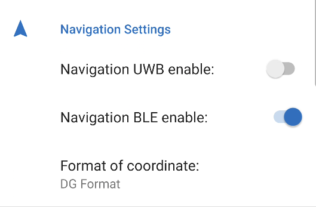

 

These sources are subject to the license conditions see LICENSE file.
# 1. Table of Contents
- [1. Table of Contents](#1-table-of-contents)
- [2. Application description](#2-application-description)
  - [2.1. Introduction:](#21-introduction)
  - [2.2. Application functions:](#22-application-functions)
  - [2.3. Application settings:](#23-application-settings)
- [3. Software architecture](#3-software-architecture)
  - [3.1. Directory struct:](#31-directory-struct)
  - [3.2. Code documentation](#32-code-documentation)
  - [3.3. Software block diagram](#33-software-block-diagram)
  - [3.4. Implementation](#34-implementation)
    - [3.4.1. User interface](#341-user-interface)
    - [3.4.2. Permission management](#342-permission-management)
    - [3.4.3. Storage live data](#343-storage-live-data)
    - [3.4.4. CSVLogger](#344-csvlogger)
      - [3.4.4.1. Dependencies](#3441-dependencies)
      - [3.4.4.2. Interface](#3442-interface)
      - [3.4.4.3. Constructors](#3443-constructors)
      - [3.4.4.4. Methods](#3444-methods)
      - [3.4.4.5. Usage Example:](#3445-usage-example)
    - [3.4.5. CompassAssistant (3rd party)](#345-compassassistant-3rd-party)
    - [3.4.6. BLE scanner](#346-ble-scanner)
    - [3.4.7. BLE service](#347-ble-service)
      - [3.4.7.1. Dependencies](#3471-dependencies)
      - [3.4.7.2. Methods](#3472-methods)
    - [3.4.8. USB service](#348-usb-service)
      - [3.4.8.1. Constructors](#3481-constructors)
      - [3.4.8.2. Methods](#3482-methods)
      - [3.4.8.3. `@interface USBSerialBaudRate`](#3483-interface-usbserialbaudrate)
    - [3.4.9. RSSI Distance Calculation](#349-rssi-distance-calculation)
      - [3.4.9.1. CalculatorDistanceRSSI Class](#3491-calculatordistancerssi-class)
        - [3.4.9.1.1. `calculateDistance(measuredPower, rssi, n)`](#34911-calculatedistancemeasuredpower-rssi-n)
          - [3.4.9.1.1.1. Parameters:](#349111-parameters)
          - [3.4.9.1.1.2. Returns:](#349112-returns)
    - [3.4.10. Kalman Filter Implemenatation](#3410-kalman-filter-implemenatation)
      - [3.4.10.1. Kalman Filter Equations](#34101-kalman-filter-equations)
      - [3.4.10.2. KalmanFilter Class](#34102-kalmanfilter-class)
        - [3.4.10.2.1. Constructors](#341021-constructors)
        - [3.4.10.2.2. Methods](#341022-methods)
        - [3.4.10.2.3. Properties](#341023-properties)
    - [3.4.11. Exdended Kalman Filter](#3411-exdended-kalman-filter)
      - [3.4.11.1. Mathematical Description of the Extended Kalman Filter](#34111-mathematical-description-of-the-extended-kalman-filter)
      - [3.4.11.2. ExdendedKalmanFilter Class](#34112-exdendedkalmanfilter-class)
        - [3.4.11.2.1. Constructor](#341121-constructor)
        - [3.4.11.2.2. Public Methods](#341122-public-methods)
    - [3.4.12. Aplication logging](#3412-aplication-logging)
      - [3.4.12.1. Methods](#34121-methods)
      - [3.4.12.2. Usage Example:](#34122-usage-example)
    - [3.4.13. Average Filter](#3413-average-filter)
      - [3.4.13.1. Mathematical Description](#34131-mathematical-description)
      - [3.4.13.2. AverageFilter Class](#34132-averagefilter-class)
        - [3.4.13.2.1. Constructor](#341321-constructor)
        - [3.4.13.2.2. `addRSSI(double Rssi)`](#341322-addrssidouble-rssi)
    - [3.4.14. Filter with average and Kalman](#3414-filter-with-average-and-kalman)
      - [3.4.14.1. FilterWithKalman Class](#34141-filterwithkalman-class)
      - [3.4.14.2. Constructor](#34142-constructor)
        - [3.4.14.2.1. `addRSSI(double Rssi)`](#341421-addrssidouble-rssi)
    - [3.4.15. Tracker direction Calculation](#3415-tracker-direction-calculation)
      - [3.4.15.1. Basics of the calculation procedure](#34151-basics-of-the-calculation-procedure)
      - [3.4.15.2. TrackerDirectionCalculator Class](#34152-trackerdirectioncalculator-class)
        - [3.4.15.2.1. Constructors](#341521-constructors)
          - [3.4.15.2.1.1. `TrackerDirectionCalculator(int measurementCount)`](#3415211-trackerdirectioncalculatorint-measurementcount)
          - [3.4.15.2.1.2. Parameters](#3415212-parameters)
        - [3.4.15.2.2. Methods](#341522-methods)
          - [3.4.15.2.2.1. `addGeo(double distance, double latitude, double longitude)`](#3415221-addgeodouble-distance-double-latitude-double-longitude)
          - [3.4.15.2.2.2. Parameters](#3415222-parameters)
          - [3.4.15.2.2.3. Returns](#3415223-returns)
        - [3.4.15.2.3. Defines](#341523-defines)
  - [3.5. Libarys and Dependensy](#35-libarys-and-dependensy)
  - [3.6. Third party software and sources](#36-third-party-software-and-sources)
- [4. Futur work and bugs](#4-futur-work-and-bugs)
  - [4.1. Bugs](#41-bugs)
  - [4.2. Futur Work](#42-futur-work)
- [5. Getting started](#5-getting-started)
  - [5.1. Install application](#51-install-application)
  - [5.2. Launch application](#52-launch-application)
  - [5.3. References](#53-references)
- [6. Author](#6-author)
- [7. Copyright](#7-copyright)


# 2. Application description

## 2.1. Introduction:
The application consists of 5 graphical interfaces. All settings and configurations can be made in the 5 ui-interface (Settings). All other surfaces are intended only for the graphical representation of the data.


You can navigate between the individual surfaces using the BottomNavigationBar :  .


## 2.2. Application functions:

**The application has three main functionalities:**

1. acquisition and evaluation of measurement data.
      * This application acquires and evaluates data such as: "RSSI via BLE and UWB, TOA via UWB, distance to a device via BLE and UWB, GBS, axiometer and magnetometer".
2. graphical display of the measurement data.
      * The measured data is graphically processed and made available to the user in the form of various interfaces.
3. recording of measurement data via ".csv".
      * Furthermore, the user is enabled to write the measured and evaluated data into a CSV file.

## 2.3. Application settings:

**The application has four settings groups:**

1. BLE Settings

    

      When the BLE switch is off, the BLE name of the device to be tracked can be selected (via the Coose BLE devices button). The connection with the Bloetooht device can be established via the BLE Enable button.

2. UWB Settings
    
    

    

    If Bluetooth is switched off on the mobile device, this is indicated in the settings. If the user then presses the button, a broadcast is sent to the operating system, and the operating system switches the Bluetooth on. After the Bluetooth is switched on, it is possible for the user to search for devices. The selected device will be saved. Consequently, after restarting the application, the system reconnects to the device. If this is not desired, click on the button agin.
      
3. Navigation Settings.

    

    In the navigation settings, the measurement method for determining the direction of the device in the navigation fragment can be selected. If UWB and BLE are not selected, the pointer in the NAV UI shows the direction to the N pole (compass). (Compass) In addition, the display format of the coordinates in the NAV UI can be set. (GSM, GMM, DG)

4. CSV Settings.
    
    
    
    Under the heading CSV settings you can configure the behavior of the Csv logger. And with the switch Activate measurement data the CSV logger can be activated. After activating the CSV logger, it will write data to a CSV file until the time has expired or the process is aborted. (Please note that Android can only process data sizes >2GB very slowly). For data larger than 2GB, it is recommended to split it into multiple files. You can do this with the setting "Select number of lines per file". Furthermore, the starting and stopping of the CSV logger is indicated with a small popup.

# 3. Software architecture

## 3.1. Directory struct:

``` txt
.
└── 030_Software/032_Application/IOTLocatioTrackerAPP/
    ├── .gradle/
    ├── .idea/
    ├── app/
    │   ├── build/
    │   ├── libs/
    │   ├── src/
    │   │   ├── androidTest/
    │   │   ├── debug/
    │   │   ├── main\java\com\rramsauer\iotlocatiotrackerapp/
    │   │   │   ├── enviromment/
    │   │   │   │   └── ...
    │   │   │   ├── services/
    │   │   │   │   ├── ble/
    │   │   │   │   │   └── ...
    │   │   │   │   └── usb/
    │   │   │   │       └── ...
    │   │   │   ├── storage/
    │   │   │   │   ├── csv/
    │   │   │   │   │   └── ...
    │   │   │   │   └── state/
    │   │   │   │       └── ...
    │   │   │   ├── ui/
    │   │   │   │   ├── adapter/
    │   │   │   │   │   └── ...
    │   │   │   │   ├── view/
    │   │   │   │   │   └── ...
    │   │   │   │   ├── preference/
    │   │   │   │   │   └── ...
    │   │   │   │   └── models/
    │   │   │   │       └── ...
    │   │   │   ├── util/
    │   │   │   │   └── ...
    │   │   │   └── MainActivity.java
    │   │   └── test/
    │   │       └── ..
    │   ├── .gitignore
    │   ├── build.gradle
    │   └── proguard-rules.pro
    ├── gradle/
    ├── img/
    │   └── ... (Image for Readme)
    ├── vpproject/
    │   └── IOTLocatioTrackerAPP.vpp
    ├── .gitignore
    ├── build.gradle
    ├── gradle.properties
    ├── gradlew
    ├── gradlew.bat
    ├── local.properties
    ├── README.html
    ├── README.md
    └── settings.gradle
```
## 3.2. Code documentation
All source code was documented with javadoc. [More Information](https://www.oracle.com/technical-resources/articles/java/javadoc-tool.html)

## 3.3. Software block diagram


## 3.4. Implementation

### 3.4.1. User interface

The user interface was implemented with Androidx, AppCompatActivity and Fragments. For the implementation of the fragments a model-view implentation was used to ensure maximum flexibility. Furthermore, for the use of constants, the xml resources recommended by androit were used.
(e.g.: res/values/strings.xml).

### 3.4.2. Permission management
All permissions are managed in AppPermmissionManager. If a new permission is needed in the app, it should be added to the `AppPermissionsManager` class in the `addPermissionToPermissionList` function and in the Manifest.xml.
For example:
*AppPermissionsManager*
```java
@Retention(RetentionPolicy.SOURCE)
@IntDef({...,YOUR_PERMISSION_GROUP})
public @interface PermissionTyp {}
/* Define permission-group typ */
...
public static final int YOUR_PERMISSION_GROUP = 100;

....
private void addPermissionToPermissionList(){
    ...
    permissionList.add(new AppPermission(Manifest.permission.YOUR_PERMISSION,YOUR_PERMISSION_GROUP));
}
...
```

*AndroidManifest.xml*
```xml
    <uses-permission android:name="android.permission.YOUR_PERMISSION" />
```

### 3.4.3. Storage live data

All live data is stored and read out in a threadsave singelton opject. (../storage/state/ActualMeasuringData)
```java
public class ActualMeasuringData implements Serializable {
    private static ActualMeasuringData INSTANCE = null;
    /* Bluetooth LE */
    private String bleDeviceName;
    private String bleDeviceId;
    private double bleRssi;
    private double bleRssiFiltered;
    private double bleDistance;
    private double bleDirection;
    private boolean bleDeviceIsConnected;
    /* Ultra-Wide-band */
    private String uwbDeviceShortAddress;
    private String uwbDeviceUid;
    private double uwbRssi;
    private double uwbRssiFiltered;
    private double uwbDistanceToa;
    private double uwbDistanceRssi;
    private double uwbDirection;
    private boolean uwbDeviceIsConnected;
    /* Navigation */
    private double deviceDirection;
    private double deviceGeoDirection;
    private double deviceMovementDirection;
    private double deviceCoordinateLongitudeDG; /* N - S */
    private double deviceCoordinateLatitudeDG; /* E - W */
    private Location deviceLocation;

    public static ActualMeasuringData getInstance() {
        if (INSTANCE == null) {
            synchronized (ActualMeasuringData.class) {
                if (INSTANCE == null) {
                    INSTANCE=new ActualMeasuringData();
                }
            }
        }
        return INSTANCE;
    }

    /* Getter */
    ...

    /* Setter */
    ...
}
```

### 3.4.4. CSVLogger

The CsvLogger class provides a service that allows writing data in a previously defined interval for a previously defined time. All settings like file name, directory, logging interval, number of rows per file, and recording time are passed via the constructor.

#### 3.4.4.1. Dependencies

This class requires the following Gradler imports:

```
implementation 'com.opencsv:opencsv:5.7.1'
```

The class also needs the following classes:

```
com.rramsauer.iotlocatiotrackerapp.util.conv.StringConverter
com.rramsauer.iotlocatiotrackerapp.util.storage.FileManagementHelper
```

To use this class, the following permissions must be included in the `AndroidManifest.xml` file:

```
<uses-permission android:name="android.permission.WRITE_EXTERNAL_STORAGE" />
<uses-permission android:name="android.permission.WAKE_LOCK" />
```

#### 3.4.4.2. Interface

The `CsvLogger` class also has an interface named `CsvLoggerWriter`, which allows capturing and writing data line by line. The `CsvLoggerWriter` interface has three methods:

- `onCsvLoggerStarted()`: This method is called when the CSV logger is started.
- `onRunCsvLogger()`: This method is called every iteration when the CSV logger is running. This method is used to pass the data for one line. It returns the data in the form of a java stateful bean object.
- `onCsvLoggerStopped()`: This method is called when the CSV logger is stopped.

#### 3.4.4.3. Constructors

- `CsvLoggerWriter()`: The constructor initializes a `CsvLogger` instance with the following parameters:
  - `l`: An instance of the `CsvLoggerWriter` interface.
  - `csvDirectoryName`: The name of the directory where the CSV file is stored.
  - `csvFileName`: The name of the CSV file.
  - `loggingInterval`: The logging interval in milliseconds.
  - `numberOfRowPerFile`: The maximum number of rows per file.
  - `recordingTime`: The recording time in seconds.

#### 3.4.4.4. Methods

- `start()`: This method starts the CSV logger.
- `stop()`: This method stops the CSV logger.
- `writeCsv()`: This method writes a single row to the CSV file.
- `getDurationInSecond()`: This method returns the duration of the recording in seconds.


#### 3.4.4.5. Usage Example:
```java
public class MainActivity extends Activity implements CsvLogger.CsvLoggerWriter<CsvStatefulBean> {

      @Override
      protected void onCreate(@Nullable Bundle savedInstanceState) {
            super.onCreate(savedInstanceState);
            this.compass = (ImageView) findViewById(R.id.csv_view);
      }

      @Override
      protected void onResume() {
            super.onResume();
            // INIT CSV-Logger
            csvLogger = new CsvLogger<CsvStatefulBean>(
                  this,
                  Environment.getExternalStorageDirectory().getPath() + "/Test/",   /* parentDirectory:String */
                  "test.csv",                                                       /* csvFileName:String */
                  10,                                                               /* loggingInterval:int */
                  10000,                                                            /* numberOfRow:int */
                  15                                                                /* recordingTime:int */
            );
            /* Start CSV-Logger*/
            csvLogger.start();    
      }

      @Override
      protected void onPause() {
            // Stop CSV-Logger
            csvLogger.stop();
      }

      /** This function override onCsvLoggerStarted()
      * @author Ramsauer René
      * @override onCsvLoggerStarted of class CsvLogger
      */
      @Override
      public void onCsvLoggerStarted() {
      }

      /** This function override onRunCsvLogger()
      * @author Ramsauer René
      * @override onRunCsvLogger of class CsvLogger
      */
      @Override
      public CsvStatefulBean onRunCsvLogger() {
            ActualData tempLiveData = ActualData.getInstance();
            return new CsvStatefulBean(
                  new Date(),                           /* time:Date */
                  tempLiveData.getBleDeviceName(),      /* bleDeviceName:String */
                  tempLiveData.getBleDeviceId(),        /* bleDeviceId:String */
                  tempLiveData.getBleRssi(),            /* bleDeviceId:String */
                  tempLiveData.getBleDistance(),        /* bleDistance:Double */
                  tempLiveData.getBleDirection(),       /* bleDirection:Double */
                  ...
            );
      }

    /** This function override onCsvLoggerStopped()
     * @author Ramsauer René
     * @override onCsvLoggerStopped of class CsvLogger
     */
    @Override
    public void onCsvLoggerStopped() {
    }

}
```

### 3.4.5. CompassAssistant (3rd party)

For the implementation of the compass, due to various complications, an implementation by Artur Hellmann was used, as it could show good experience values in the network. However, this should be revised and improved in the future to make a more accurate statement about the measurement.
Usage Example:

```java
public class CompassActivity extends Activity implements CompassAssistant.CompassAssistantListener {

    private CompassAssistant CompassAssistant;
    private float currentDegree;

    @Override
    protected void onCreate(@Nullable Bundle savedInstanceState) {
        super.onCreate(savedInstanceState);
        this.compass = (ImageView) findViewById(R.id.compass_view);
    }

    @Override
    protected void onResume() {
        super.onResume();

        // this assistant will point to the magnetic north. If you want to have a compass that points
        // to the geographic north, you have to put a location into the constructor.
        CompassAssistant = new CompassAssistant(CompassActivity.this);
        CompassAssistant.addListener(CompassActivity.this);
        CompassAssistant.start();
            
    }

    @Override
    protected void onPause() {
        super.onPause();
        this.CompassAssistant.stop();
    }

    @Override
    public void onNewDegreesToNorth(float degrees) {
        // this is not used here because we want to have a smooth moving compass.
    }

    @Override
    public void onNewSmoothedDegreesToNorth(float degrees) {

        final RotateAnimation ra = new RotateAnimation(
                currentDegree,
                degrees,
                Animation.RELATIVE_TO_SELF, 0.5f,
                Animation.RELATIVE_TO_SELF,
                0.5f);
        ra.setDuration(210);
        ra.setFillAfter(true);

        this.runOnUiThread(new Runnable() {
            @Override
            public void run() {
                compass.startAnimation(ra);
            }
        });

        currentDegree = degrees;

        /*
        If you want you can get the bearing between two locations right here. 
        If you do this in this function you can be sure that the compassassistant is started and
        you will get continously new degrees:
        
        float bearing = assistant.getBearingBetweenLocations(currLocLat, currLocLng, destLocLat, destLocLng);

        */

    }

    @Override
    public void onCompassStopped() {
        // the compass has stopped. Do maybe 
    }

    @Override
    public void onCompassStarted() {
        // you can do things here for example if you want to hide a loading indicator.
    }
}
```
[More Information](https://github.com/klein-artur/Simple-Android-Compass-Assistant/blob/master/README.md)

### 3.4.6. BLE scanner

The Bluetooth low energy scanner is implemented in the class BTLE_Service. This class can be easily initialized with a constructor. Then the scanner including the UI can be started with the function call start(). The scanner can only find devices that also have the Suppoerted Services, these can be specified in the `btle_supported_gatt_attributes.xml`.
Supported Services must be entered in the `btle_supported_gatt_attributes.xml` as follows:

```xml
    <service uuid="...." name="..." id="...">
        <characteristic uuid="..." name="..." id="..."/>
        <characteristic uuid="..." name="..." id="..."/>
    </service>
```


### 3.4.7. BLE service

The `BTLE_Service` class is responsible for managing the Bluetooth Low Energy (BLE) connection with a peripheral device. It provides a remote RSSI listener that can be used to receive real-time updates on the received signal strength indicator (RSSI) of the connected peripheral device. The class implements the `Service` interface, which means that it runs in the background and can be accessed from other components of an Android application.

#### 3.4.7.1. Dependencies

The class also needs the following classes:

```
com.rramsauer.iotlocatiotrackerapp.MainActivity;
com.rramsauer.iotlocatiotrackerapp.util.calc.distance.CalculatorDistanceRSSI;
com.rramsauer.iotlocatiotrackerapp.util.calc.filter.KalmanFilter;
com.rramsauer.iotlocatiotrackerapp.util.calc.filter.SmoothWithAverage;
com.rramsauer.iotlocatiotrackerapp.util.log.Logger;
com.rramsauer.iotlocatiotrackerapp.util.str.StringFormatCheck;
```

To use this class, the following permissions must be included in the `AndroidManifest.xml` file:

```
<uses-permission android:name="android.permission.BLUETOOTH" />
<uses-permission android:name="android.permission.BLUETOOTH_ADMIN" />
<uses-permission android:name="android.permission.ACCESS_FINE_LOCATION" />
```

#### 3.4.7.2. Methods

- `onCreate()`: This method is called when the service is created.
- `onBind(Intent intent)`: This method is called when a component binds to the service.
- `onStartCommand(Intent intent, int flags, int startId)`: This method is called when the service is started.
- `onDestroy()`: This method is called when the service is destroyed.
- `connect(String address)`: This method is used to connect to a peripheral device with the given Bluetooth device address.
- `disconnect()`: This method is used to disconnect from the currently connected peripheral device.
- `broadcastUpdate(final String action)`: This method sends a broadcast with the given action identifier to all registered receivers.
- `onNewRssi( BluetoothGatt gatt, double rssi, double rssiFiltered, double distanc, int status )`: This method is provide with a inheritance interface (`RemoteRssiListener`) and implements an RSSI-listener.

### 3.4.8. USB service
The `UsbSerialReader` class is a Java class that implements the `ArduinoListener` interface to handle data read from an Arduino device connected via USB. This class is responsible for initializing the communication with the device, parsing the data received from the device, and updating the `ActualMeasuringData` singleton object with the parsed data.

#### 3.4.8.1. Constructors

The `UsbSerialReader` class has two constructors:

- `UsbSerialReader(android.content.Context context, @UsbSerialReader.USBSerialBaudRate final int baudRate)`: Constructs a new `UsbSerialReader` object with the specified context and baud rate.
- `UsbSerialReader(android.content.Context context, @UsbSerialReader.USBSerialBaudRate final int baudRate, int vendorId)`: Constructs a new `UsbSerialReader` object with the specified context, baud rate, and vendor ID. This constructor is used if the USB device is not an Arduino device.

#### 3.4.8.2. Methods

The `UsbSerialReader` class has the following methods:

- `init(Context context, int baudRate)`: Initializes the communication with the USB device.
- `init(Context context, int baudRate, int vendorId)`: Initializes the communication with the USB device. This method is used if the USB device is not an Arduino device.
- `getValueOfMeasuringString(String measuringString)`: Parses the measuring string received from the Arduino device and returns a `UsbSerialMessageData` object containing the parsed data.
- `setListener()` : Sets the listener for read serial data from usb device.
- `close()` : Closes the UsbSerialReader and sets the UWB device as disconnected.
- `setUwbShortAddress(String uwbShortAddress)` : Sets the UWB short address of the follower.

#### 3.4.8.3. `@interface USBSerialBaudRate`

Defines the available baud rates for USB serial communication. The following constants are available:

* `BAUD_RATE_300`
* `BAUD_RATE_1200`
* `BAUD_RATE_2400`
* `BAUD_RATE_4800`
* `BAUD_RATE_9600`
* `BAUD_RATE_19200`
* `BAUD_RATE_38400`
* `BAUD_RATE_57600`
* `BAUD_RATE_74880`
* `BAUD_RATE_115200`
* `BAUD_RATE_230400`
* `BAUD_RATE_250000`

### 3.4.9. RSSI Distance Calculation

#### 3.4.9.1. CalculatorDistanceRSSI Class

The `CalculatorDistanceRSSI` class provides a static method to calculate distance using RSSI values.

##### 3.4.9.1.1. `calculateDistance(measuredPower, rssi, n)`
Thsi methode is based on the * Friis transmission equation* and is commonly used in RSSI distance measurement. This calculation is also called the *Log-Distance Path Loss Model* and is a common method for distance estimation with RSSI.
Three variables are needed for the formula: the measured value, the measured value at one meter distance, and the path loss exponent. The path loss exponent should be between 1 and 4, depending on the measurement environment (e.g., indoor or outdoor, frequency, and other factors). We man aus den Paper [7] [8]

$$d = 10^{(TxPower - RSSI) \over (10 * n)} $$(1)

- $TxPower$: the transmit power of the transmitter in dBm (decibel-milliwatt)
- $RSSI$: the received signal strength indicator in dBm
- $n$: the path-loss exponent, which depends on the environment (e.g., indoor or outdoor), frequency, and other factors. It typically ranges from 2 to 4.

###### 3.4.9.1.1.1. Parameters:

- `measuredPower`: The measured power value (double)
- `n`: The path-loss exponent value (double)
- `rssi`: The received signal strength indicator (RSSI) value (double)


###### 3.4.9.1.1.2. Returns:
- The distace in meters (double)

### 3.4.10. Kalman Filter Implemenatation

The implementation of the Kalman filter is a third party implementation. See **Third party software and sources table** [5].

#### 3.4.10.1. Kalman Filter Equations
The Kalman filter is designed to work with linear systems, where the system dynamics can be modeled using linear equations and is the optimal solution for filtered Rssi. [1] [2] [3]

| Formulas | Description |
| --- | --- |
| $$\hat{x}_k^- = F_{k-1}\hat{x}_{k-1} + B_k u_{k-1}$$(3) | Prediction step: Estimate the state at time k given the estimate at time k-1 and the control input u at time k-1 using the state transition matrix F and control input matrix B |
| $$P_k^- = F_{k-1} P_{k-1} F_{k-1}^T + Q_{k-1}$$(4) | Calculate the predicted error covariance matrix at time k |
| $$y_k = z_k - H_k\hat{x}_k^-$$(5) | Calculate the novelty at time k |
| $$S_k = H_k P_k^- H_k^T + R_k$$(7) | Calculate the innovation covariance matrix at time k based on the predicted error |
| $$K_k = P_k^- H_k^T S_k^{-1}$$(8) | Compute the Kalman gain at time k  |
| $$\hat{x}_k = \hat{x}_k^- + K_k y_k$$(9) | Update the state estimate at time k |
| $$P_k = (I - K_k H_k) P_k^-$$(10) | Update the error covariance matrix at time k  |

Description of the variables used in the formulas:

- $\hat{x}_k^-$: predicted state estimate at time k
- $\hat{x}_{k-1}$: state estimate at time k-1
- $u_{k-1}$: control input at time k-1
- $F_{k-1}$: state transition matrix at time k-1
- $B_k$: control input matrix at time k
- $P_k^-$: predicted error covariance matrix at time k
- $Q_{k-1}$: process noise covariance matrix at time k-1
- $z_k$: measurement at time k
- $H_k$: measurement matrix at time k
- $y_k$: innovation at time k
- $R_k$: measurement noise covariance matrix at time k
- $S_k$: innovation covariance matrix at time k
- $K_k$: Kalman gain at time k

#### 3.4.10.2. KalmanFilter Class

The `KalmanFilter`[7] class is an implementation of the Kalman filter algorithm. The class allows for the creation of a Kalman filter with specified values for the process noise and measurement noise, as well as optional values for the state vector, control vector, and measurement vector. 

##### 3.4.10.2.1. Constructors

The `KalmanFilter` class has two constructors:
* `KalmanFilter(double r, double q, double a, double b, double c)`: creates a new Kalman filter with specified values for:
    - the process noise `r`,
    - measurement noise `q`,
    - state vector `a`,
    - control vector `b`,
    - measurement vector `c`.
* `KalmanFilter(double r, double q)`: creates a new Kalman filter with specified values for
    - the process noise `r` 
    measurement noise `q`
    **(This constructor is used in this project)**

##### 3.4.10.2.2. Methods

The `KalmanFilter` class has three methods:
* `applyFilter(double rssi)`: applies the Kalman filter to a measurement with default control value of `0.0`.
* `applyFilter(double measurement, double u)`: applies the Kalman filter to a measurement with a control value `u`.
* `toString()`: returns a string representation of the `KalmanFilter` object.

##### 3.4.10.2.3. Properties

The `KalmanFilter` class has the following properties:
* `R`: the process noise.
* `Q`: the measurement noise.
* `A`: the state vector.
* `B`: the control vector.
* `C`: the measurement vector.
* `x`: the filtered measurement value (no noise).
* `cov`: the covariance.

### 3.4.11. Exdended Kalman Filter
The extended Kalman filter is designed to work with nonlinear systems.  Since the RSSI value has a non-linear behavior with respect to the distance, theoretically this filter would be more suitable. In this experiment, however, no better result could be achieved, so the implementation of the class was removed and the normal Kalman filter was implemented.
Die matematische beschreibung wurde aus den folgenden Paper entnommen. [9]

**This class is currently not in use but is available in the directory "util".**

#### 3.4.11.1. Mathematical Description of the Extended Kalman Filter


| Formulas | Description |
| --- | --- |
| $$\hat{x}_k^- = f(\hat{x}_{k-1}, u_{k-1})$$(11) | Prediction step: Estimate the state at time k given the estimate at time k-1 and the control input u at time k-1 using the nonlinear function f |
| $$P_k^- = F_{k-1} P_{k-1} F_{k-1}^T + Q_{k-1}$$(12) | Calculate the predicted error covariance matrix at time k |
| $$y_k = z_k - h(\hat{x}_k^-)$$(13) | Calculate the novelty at time k |
| $$S_k = H_k P_k^- H_k^T + R_k$$(14) | Calculate the innovation covariance matrix at time k |
| $$K_k = P_k^- H_k^T S_k^{-1}$$(15) | Compute the Kalman gain at time k |
| $$\hat{x}_k = \hat{x}_k^- + K_k y_k$$(16) | Update the state estimate at time k |
| $$P_k = (I - K_k H_k) P_k^-$$(17) | Update the error covariance matrix at time k |


Here's a brief description of the variables used in the formulas:

- $\hat{x}_k^-$: predicted state estimate at time k
- $\hat{x}_{k-1}$: state estimate at time k-1
- $u_{k-1}$: control input at time k-1
- $f$: nonlinear state transition function
- $P_k^-$: predicted error covariance matrix at time k
- $F_{k-1}$: state transition matrix at time k-1
- $Q_{k-1}$: process noise covariance matrix at time k-1
- $z_k$: measurement at time k
- $h$: measurement function
- $y_k$: innovation at time k
- $H_k$: measurement matrix at time k
- $R_k$: measurement noise covariance matrix at time k
- $S_k$: innovation covariance matrix at time k
- $K_k$: Kalman gain at time k

#### 3.4.11.2. ExdendedKalmanFilter Class
The `ExtendedKalmanFilter` class is an implementation of an extended Kalman filter for estimating the distance of a mobile device based on received signal strength indication (RSSI) measurements.

##### 3.4.11.2.1. Constructor
- `ExtendedKalmanFilter()`: Constructs a new `ExtendedKalmanFilter` object with default initial values for the matrices.

##### 3.4.11.2.2. Public Methods
- `double addRSSI(double rssi)`: Returns the estimated distance of the tracker device.

### 3.4.12. Aplication logging

The `Logger` class provides a way to log messages with different log levels. The log level is set by changing the value of the `LOGLEVEL` constant. The different log levels are `ERROR`, `INFORMATION`, `WARNING`, `VERBOSE`, and `DEBUG`. Each log level has two versions of the method, one that takes only a tag and a message and one that also takes a `StackTraceElement` parameter that provides information about the location of the log statement in the code. This class extends the log information of the class Log.

#### 3.4.12.1. Methods

- `v(String tag, String msg)`: Logs a verbose message with the given tag and message.
- `v(String tag, String msg, @NonNull StackTraceElement ste)`: Logs a verbose message with the given tag, message, and `StackTraceElement`.
- `d(String tag, String msg)`: Logs a debug message with the given tag and message.
- `d(String tag, String msg, @NonNull StackTraceElement ste)`: Logs a debug message with the given tag, message, and `StackTraceElement`.
- `i(String tag, String msg)`: Logs an information message with the given tag and message.
- `i(String tag, String msg, @NonNull StackTraceElement ste)`: Logs an information message with the given tag, message, and `StackTraceElement`.
- `w(String tag, String msg)`: Logs a warning message with the given tag and message.
- `w(String tag, String msg, @NonNull StackTraceElement ste)`: Logs a warning message with the given tag, message, and `StackTraceElement`.
- `e(String tag, String msg)`: Logs an error message with the given tag and message.
- `e(String tag, String msg, @NonNull StackTraceElement ste)`: Logs an error message with the given tag, message, and `StackTraceElement`.

The `Logger` class also has a `LOGLEVEL` constant that can be used to set the log level. The class provides several boolean constants that can be used to determine whether a particular log level is enabled or not. These constants are `ERROR`, `INFORMATION`, `WARNING`, `VERBOSE`, and `DEBUG`. The value of each boolean constant depends on the value of the `LOGLEVEL` constant.

#### 3.4.12.2. Usage Example:

```Java
/* VERBOSE ACTION */
Logger.v("TAG", "msg",Thread.currentThread().getStackTrace()[2]);
```

Terminal:

```Log
V/TAG: <YYYY-MM-DD hh:mm:ss> [com.rramsauer.iotlocatiotrackerapp.Class|func|1] msg
```
### 3.4.13. Average Filter
The AverageFilter class implements a simple moving average filter that operates on a stream of values. The filter uses a sliding window of a specified size to calculate the average of the last n values in the stream.
#### 3.4.13.1. Mathematical Description
The AverageFilter class can be described matematically as follows:

$$
\text{direction} = \frac{1}{countOfValues} \sum_{i=1}^{countOfValues} values[i]
$$(18)

Therefore, if the fordefined array is full of values, the last added value is overwritten with the new value and then the average of all values in the array is calculated..

#### 3.4.13.2. AverageFilter Class

`countOfValues` Define the number of values which will be used for averaging.
`values` Is the array of stored values. The count of elements in the array is set with `countOfValues`.
`arrayPosition` Represents the current position in the 'Values' array.


##### 3.4.13.2.1. Constructor

```java
public AverageFilter(int countOfValues, double startValue) {}
```

- Initialize `countOfValues`.
- Initialize `values` as an array of `countOfValues` floating-point numbers, with each element set to `startValue`.
- Initialize `arrayPosition` amd set it to 0.

##### 3.4.13.2.2. `addRSSI(double Rssi)`

```java
public double addRSSI(double Rssi) {}
```

- Set the `arrayPosition`-th element of `values` to `Rssi`.
- Update `arrayPosition` to `(arrayPosition+1)%countOfValues`.
- Compute the sum of all values in the `values` array.
- Compute the average of the values in the `values` array by dividing the sum by `countOfValues`.
- Return the average as the output of the method.


### 3.4.14. Filter with average and Kalman
The FilterWithKalman class is a Java implementation of a filter for RSSI (Received Signal Strength Indicator) values, which uses both a [moving average filter](#3314-average-filter) and a [Kalman Filter](#3310-kalman-filter-implemenatation). The moving average filter is applied to smooth the RSSI values, and the Kalman filter is applied to estimate the true RSSI value based on the noisy measurements.

#### 3.4.14.1. FilterWithKalman Class

#### 3.4.14.2. Constructor
```java
public FilterWithKalman(int countOfValues, double startValue) {}
```

##### 3.4.14.2.1. `addRSSI(double Rssi)`
```java
public double addRSSI(double Rssi) {}
```

### 3.4.15. Tracker direction Calculation
We have implemented two classes. However, we did not succeed in determining an approximate direction.
The following classes have been implemented:
- TrackerDirectionCalculator - This class is currently in inizialized.
  - Error description direction determination only possible in the open under optimal conditions.
- GeoDirectionCalculator - This class is not initialized.
  - Implementation error: Does not return a direction.

#### 3.4.15.1. Basics of the calculation procedure


The idea behind determining the direction of the tracker was:
By changing the position of the mobile device, two distance estimates can be made to one tracker. With the distance covered, a triangle can then be formed. Which makes it possible to determine the direction of the tracker via drigonometry. This can be determined by the information position 1 (latitute, longtitute, distance to the tracker) and position 2 (latitute, longtitute, distance to the tracker) as well as the moved direction in dependence of the direction to the north. Subsequently, only the orientation of the device has to be determined and added. Mathematically and theoretically this seemed clear. However, the interfering factors are so large that the implementation of filter systems is necessary. Simple filter systems have already been implemented. However, in order to achieve the desired result, further implementations must be carried out.

#### 3.4.15.2. TrackerDirectionCalculator Class

The `TrackerDirectionCalculator` class is used to calculate the direction of a moving object based on a series of distance and geolocation measurements.

##### 3.4.15.2.1. Constructors

###### 3.4.15.2.1.1. `TrackerDirectionCalculator(int measurementCount)`

Constructs a new `TrackerDirectionCalculator` with the specified number of measurements.

###### 3.4.15.2.1.2. Parameters
- `measurementCount`: the number of measurements to use for direction calculation

##### 3.4.15.2.2. Methods

###### 3.4.15.2.2.1. `addGeo(double distance, double latitude, double longitude)`

Adds a new distance and geolocation measurement to the calculator and returns the calculated direction.

###### 3.4.15.2.2.2. Parameters
- `distance`: the distance traveled since the last measurement
- `latitude`: the current latitude of the object being tracked
- `longitude`: the current longitude of the object being tracked

###### 3.4.15.2.2.3. Returns
- the direction in degrees, based on the current and previous measurements

##### 3.4.15.2.3. Defines
- `MIN_MOVEMENT_IN_M`: the minimum movement in meters required to calculate a new direction

## 3.5. Libarys and Dependensy

This application use following libarys and dependensy:
| Name | Gradle Include | Version | Reason |
|---|---|---|---|
| [Opencsv](https://opencsv.sourceforge.net/) | implementation 'com.opencsv:opencsv:5.7.1'| 5.7.1 | Can work with stateful bean. |
| [Arduino Serial](https://github.com/OmarAflak/Arduino-Library) | implementation 'me.aflak.libraries:arduino:1.4.5'| 1.4.5 | USB serial communication. |
| [Project Lombok](https://mvnrepository.com/artifact/org.projectlombok/lombok) | compileOnly 'org.projectlombok:lombok:1.18.24'| 1.18.24 | Automatic Resource Management. |
| [EJML](https://mvnrepository.com/artifact/org.ejml/ejml-core) | implementation 'org.ejml:ejml-core:0.39'| 0.39 | Dense and sparse matrix linear algebra. |

## 3.6. Third party software and sources

This application implements sources from the following third parties:

| Name | Author | Impl. Application |Source | Version |
|---|---|---|---|---|
| CompassAssistant | [Artur Hellmann](https://github.com/klein-artur) | com.rramsauer.iotlocatiotrackerapp.util.compassAssistant.CompassAssistant | [github](https://github.com/klein-artur/Simple-Android-Compass-Assistant)   | V1.0       |
 | KalmannFilter| [Z3R0](https://stackoverflow.com/users/9993413/z3r0) | com.rramsauer.iotlocatiotrackerapp.util.Filter.KalmanFilter| [stackoverflow](https://stackoverflow.com/questions/36399927/distance-calculation-from-rssi-ble-android)| None|

# 4. Futur work and bugs

## 4.1. Bugs

Toa Table in the UWB fragment the values are displayed offset.

- Settings fragment SharedPreference BUG
    - When growing to the Settings fragment a data update of UWB short address and UWB UID is done via the Bluetooth gateway Artripute.
- Direction tracker calculation does not return a value.
    - See description [Tracker direction Calculation](#3315-tracker-direction-calculation)
- If a Bluetooth scan is performed in the device settings and in the app at the same time, the application crashes.

## 4.2. Futur Work

- Position determination with different location provider. The most accurate result should be adopted.
- Move GBS location determination to service.
- Optimization of position detection to save battery.
- To improve the distance determination via RSSI, a teaching algorithm should be used which adapts the filter settings to the environment and the distance. In the course of determining the optimal filter settings, it was determined that these should be adapted according to the situation. As well as factors should be integrated which, for example, adjust the estimated distance in case of rain.
- Make MainActivity slimmer. Move code from the MainActivity to its own classes.
- Add filter settings in the SharedPrefference and SettingsFragement.
- Implement UWB service on a UWB compatible mobile device.

# 5. Getting started

## 5.1. Install application
1. Download this repository extract the Software-Source to your working directory of Android-Studio
2. Open the Project in Android Studio.
3. Adjust the Grandle settings to your environment.
4. Check AndroidManifest.xml
5. Sync Project with Grandle.
6. Change the settings of your Smartphone to development mode. [Configure on-device developer options](https://developer.android.com/studio/debug/dev-options)
7. Connect your smartphone with USB on your development computer and accept the access on the cell phone.
8. If you have done all the steps correctly, the play button on the upper right side will turn green. Now select the connected device via the device manager. (Top right corner)
9. Then you can click the play button on the upper right side and the app will be deployed to your mobile device.


*If you encounter any problems. You can get more information at [Android Developer](https://developer.android.com/).*

**Attention:** This application cannot be run with a virtual device from Android Studio. Android Studio does not support bluetooth/smartphone sensor technology.

## 5.2. Launch application

1. Open the application by clicking on the Applications icon.

   

2. Accept the requested rights.
3. Now you can use all the features of the app.

## 5.3. References
[1]"Kalman Filtering: Theory and Practice Using MATLAB" by Mohinder S. Grewal and Angus P. Andrews, 29 January 2008  ISBN:9780470377819

[2]"Introduction to Random Signals and Applied Kalman Filtering" by Robert Grover Brown and Patrick Y.C. Hwang ISBN:978-0470609699

[3] Anindya S. Paul, Student Member, IEEE, and Eric A. Wan, Member, IEEE, "RSSI-Based Indoor Localization and Tracking Using Sigma-Point Kalman Smoothers," ISSN:1941-0484

[4] J. Jurevics, D. Kanaska and G. Strazdins, "Comparison of RSSI-Based Indoor Localization Techniques for Bluetooth Low Energy Beacons," 2017 IEEE International Conference on Engineering and Technology (ICET), Antigua, Guatemala, 2017, pp. 1-6, doi: 10.1109/ICEngTechnol.2017.8125123.

[5] Distance calculation from RSSI BLE android - Stack Overflow, Stack Overflow, May 7, 2020. Adresse: https://stackoverflow.com/questions/36399927/distance-calculation-from-rssi-ble-android.

[6] Majidi, M.A., Hsieh, CS. & Yazdi, H.S. Kalman Filter Reinforced by Least Mean Square for Systems with Unknown Inputs. Circuits Syst Signal Process 37, 4955–4972 (2018). https://doi.org/10.1007/s00034-018-0792-x

[7] BLE Indoor Localization based on Improved RSSI and Trilateration by IEEE 978-1-7281-5617-0

[8] Golestani, Ali, et al. "Improving the precision of RSSI-based lowenergy localization using path loss exponent estimation." 2014 11th Workshop on Positioning, Navigation and Communication (WPNC). IEEE, 2014.

[9] Unscented Filtering and Nonlinear Estimation SIMON J. JULIER, MEMBER, IEEE, AND JEFFREY K. UHLMANN, MEMBER, IEEE
# 6. Author

| Name          | e-mail                                                                     |
|---------------|----------------------------------------------------------------------------|
| Ramsauer René | [ic18b066@technikum-wien.at](mailto:ic18b066@technikum-wien.at) |

# 7. Copyright

&copy; By Ramsauer René. (More Information: See LICENCE file)
